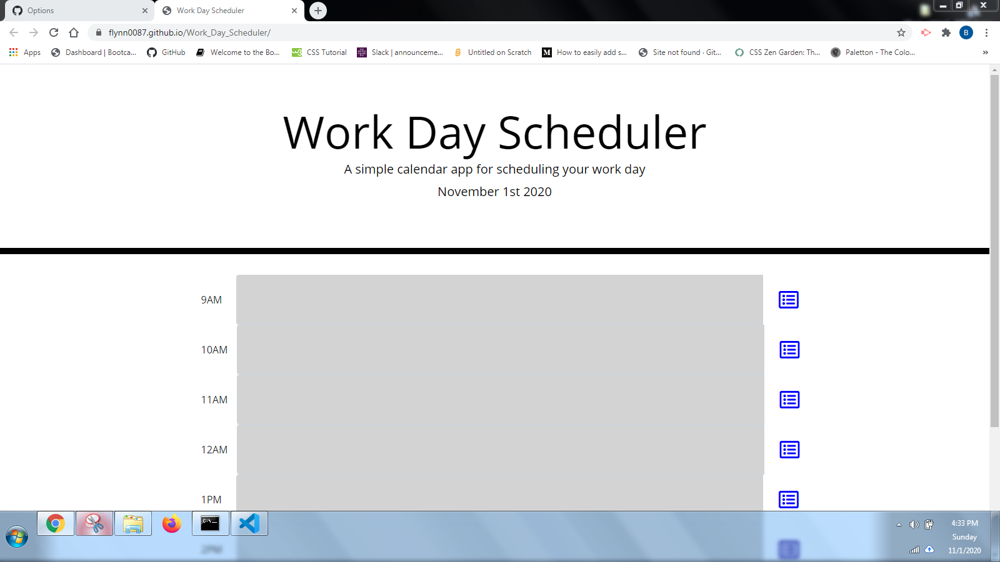

# Work_Day_Scheduler

## Description

This is a work day planner that is intended to store locally when text is entered
in the time slots and saved. It is also intended to color coordinate the boxes based on the current time.

## Installation

No installation beyond a web browser should be needed to view the webpage. A code editor such as visual studio is required to view the code.

## Usage

This webpage is viewable at: https://flynn0087.github.io/Work_Day_Scheduler/
Here is an example image of the page: 

## Contributing

I used the MIT as this is a common project and people are allowed to use it. Pull requests and advice are welcome. For major changes please create an issue first about the changes to be made.

## Credits

https://www.w3schools.com/
https://stackoverflow.com/

## License

MIT License

Copyright (c) [2020] [Benjamin Flynn]

Permission is hereby granted, free of charge, to any person obtaining a copy
of this software and associated documentation files (the "Software"), to deal
in the Software without restriction, including without limitation the rights
to use, copy, modify, merge, publish, distribute, sublicense, and/or sell
copies of the Software, and to permit persons to whom the Software is
furnished to do so, subject to the following conditions:

The above copyright notice and this permission notice shall be included in all
copies or substantial portions of the Software.

THE SOFTWARE IS PROVIDED "AS IS", WITHOUT WARRANTY OF ANY KIND, EXPRESS OR
IMPLIED, INCLUDING BUT NOT LIMITED TO THE WARRANTIES OF MERCHANTABILITY,
FITNESS FOR A PARTICULAR PURPOSE AND NONINFRINGEMENT. IN NO EVENT SHALL THE
AUTHORS OR COPYRIGHT HOLDERS BE LIABLE FOR ANY CLAIM, DAMAGES OR OTHER
LIABILITY, WHETHER IN AN ACTION OF CONTRACT, TORT OR OTHERWISE, ARISING FROM,
OUT OF OR IN CONNECTION WITH THE SOFTWARE OR THE USE OR OTHER DEALINGS IN THE
SOFTWARE.
